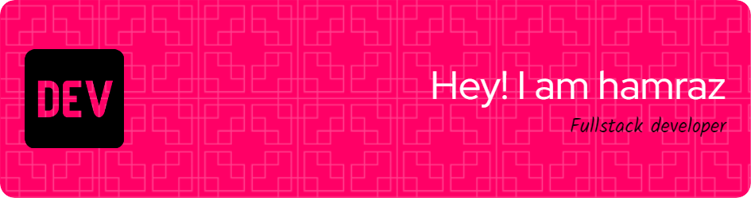

# 👋 Hi, I’m Hamraz Sheikhi

A dedicated software professional based in Tehran, specializing in software testing, systems support, and providing technical leadership. With years of experience as a fullstack developer, I'm passionate about leveraging technology to solve complex problems and enhance user experiences.

## 👀 I’m interested in
- Exploring advanced concepts in object-oriented programming to enhance software design and architecture.
- Delving into database management and optimization techniques to ensure efficient data handling in applications.
- Embracing software development processes and tools to streamline project workflows and collaboration.

## 🌱 I’m currently learning
- Parallel computing principles to leverage the power of modern hardware for faster and more scalable applications.
- Algorithms and data structures to improve problem-solving skills and optimize software performance.
- Research methodologies to contribute to academic exploration and advancements in computer science.

## 💞️ I’m looking to collaborate on
- Projects that demonstrate proficiency in object-oriented programming and showcase innovative solutions to software quality improvement and user experience enhancement.
- Initiatives involving the integration of frontend frameworks and tools to build cutting-edge web applications, while applying principles of parallel computing, computer networks, and databases.
- Contributing to an open-source project focused on helping new programmers learn coding in a more proficient way, leveraging algorithms, data structures, and best practices in software development processes and tools.

## ⚡ Fun fact
In my free time, I enjoy jogging through the serene trails of Tehran, diving into the worlds within books, and hiking the rugged landscapes of Iran.
Movies and music are my go-to sources of relaxation and inspiration. These activities help me maintain a balanced life and fuel my creativity and problem-solving skills in the tech world.

## 🚀 Entry to GitHub 
Throughout my years of experience, the companies I worked for utilized their own local Git version control system to manage codebases efficiently. Despite this, I did not have a personal GitHub account until now. I am excited to finally join the GitHub community, where I look forward to collaborating on projects, contributing to open-source initiatives, and further enhancing my skills while engaging with the global developer community.

## 📫 How to reach me
- Email: hamrazsheikhi23@gmail.com
  
